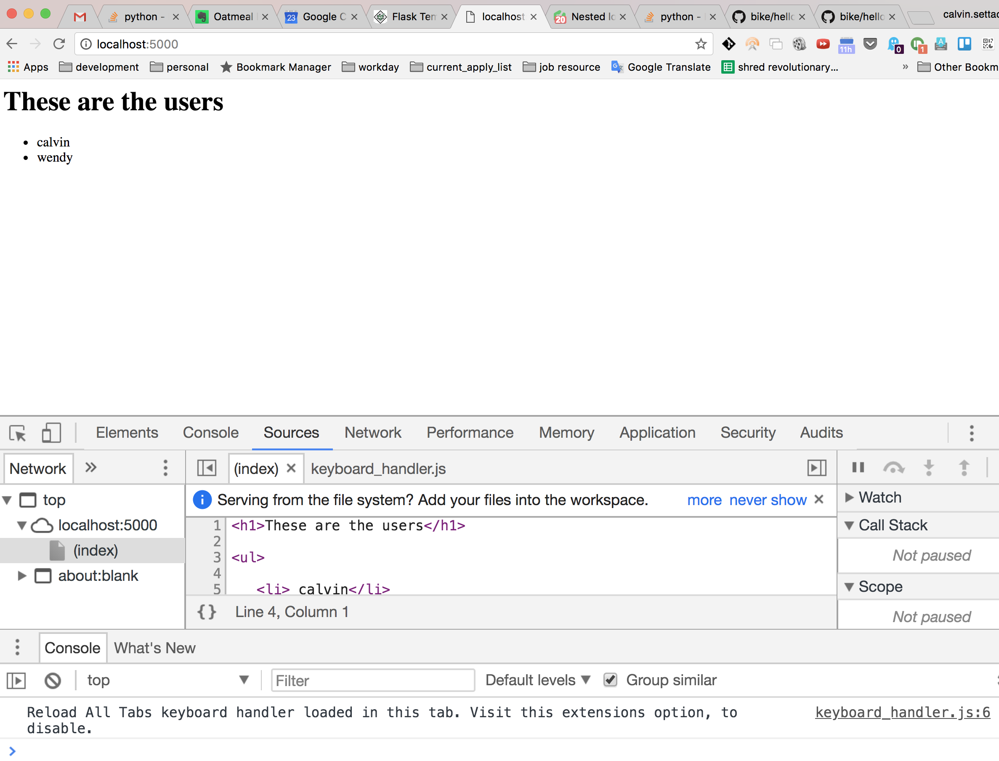

# Run Instructions

### create your virtualenv

> virtualenv venv

### activate venv

> source venv/bin/activate

### install packages in venv

> pip install -r requirements.txt

### export FLASK_APP environment variable 

> export FLASK_APP=hello.py

###  start the server 

> flask run 

### check out some pages

in browser open 

localhost:5000/
localhost:5000/calvin
localhost:5000/wendy

